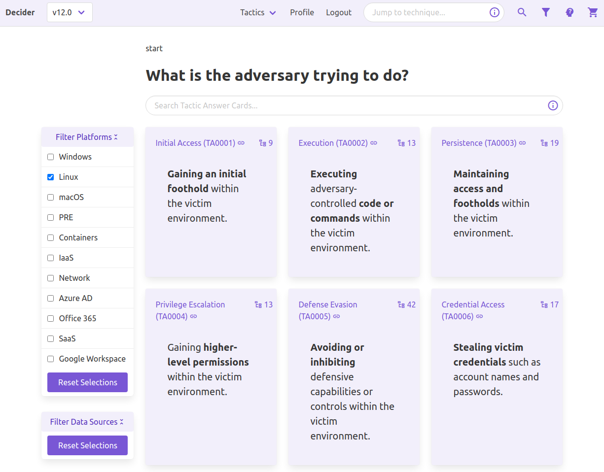
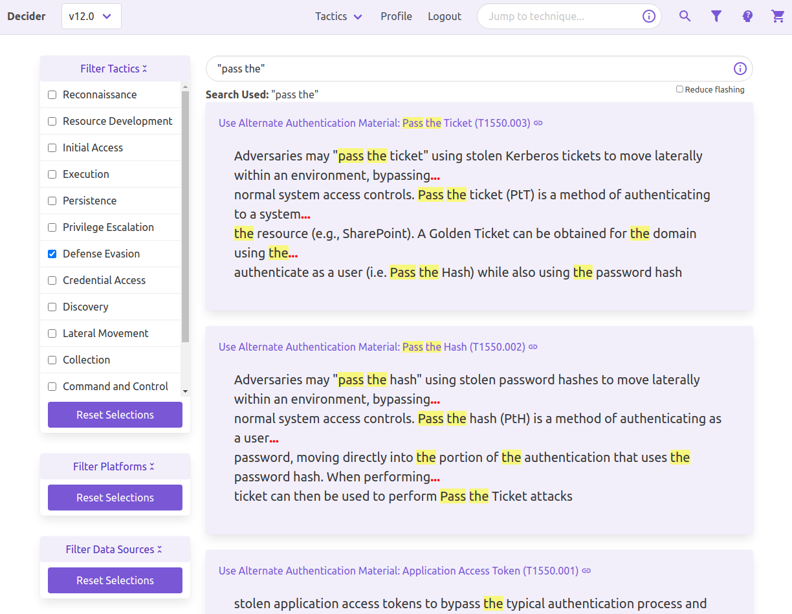
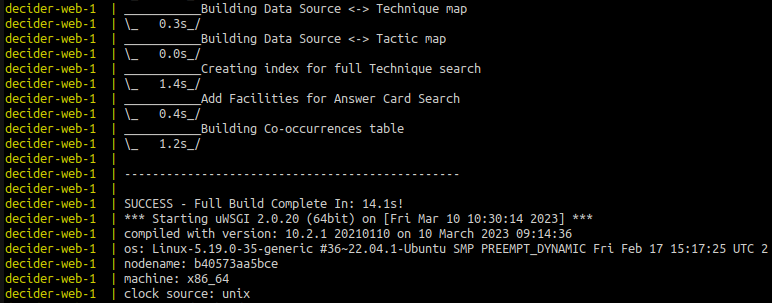

# Decider

<a rel="license" href="http://creativecommons.org/licenses/by/4.0/"></a><br />This work is licensed under a <a rel="license" href="http://creativecommons.org/licenses/by/4.0/">Creative Commons Attribution 4.0 International License</a>.

This project makes use of MITRE ATT&amp;CK&reg; - [ATT&amp;CK Terms of Use](https://attack.mitre.org/resources/terms-of-use/).

## :thinking: What is it?

### :fast_forward: In-Short

A web application that assists network defenders, analysts, and researchers in the process of mapping adversary behaviors to the MITRE ATT&CK® Framework.

### :closed_book: In-Depth

Decider is a tool to help analysts map adversary behavior to the MITRE ATT&CK Framework. Decider makes creating ATT&CK mappings easier to get right by walking users through the mapping process. It does so by asking a series of guided questions about adversary activity to help them arrive at the correct tactic, technique, or subtechnique. Decider has a powerful search and filter functionality that enables users to focus on the parts of ATT&CK that are relevant to their analysis. Decider also has a cart functionality that lets users export results to commonly used formats, such as tables and [ATT&amp;CK Navigator](https://mitre-attack.github.io/attack-navigator/) heatmaps.

### :book: User Guide

[Over Here](./docs/Decider_User_Guide_v1.0.0.pdf)

### :triangular_ruler: Intended Purpose

Decider ultimately tries to make mapping to [ATT&amp;CK](https://attack.mitre.org/) easier.

It offers:
- A question tree with pagination of results (structures your progress)
- Technique search + filtering options
- Suggestions of other techniques that may have occurred

Decider does not intend to replace the ATT&amp;CK site - but rather, it acts as a complementary tool that leads you there in the end. Only information assisting mapping is included.

## :computer: In-App Screenshots

### :deciduous_tree: Question Tree

\(*you are here*\)**\[Matrix > Tactic\]** > Technique > SubTechnique


### :mag: Full Technique Search

Boolean expressions, prefix-matching, and stemming included.


## Installation

### :whale: Docker

**Best option for 99% of people**

```bash
git clone https://github.com/cisagov/decider.git
cd decider
cp .env.docker .env

# if you want HTTPS instead of HTTP
# - edit .env
#   + WEB_HTTPS_ON='yes'
# - populate cert / key files
#   + /app/utils/certs/decider.key
#   + /app/utils/certs/decider.crt

sudo docker compose up
# sudo for Linux only
```

It is ready when **Starting uWSGI** appears


**Default Endpoint**: http://localhost:8001/

**Default Login**:
- Email: admin@admin.com
- Password: admin

**Endpoint Determination** (.env vars):
- `WEB_HTTPS_ON=''` -> http://`WEB_IP`:`WEB_PORT`/
- `WEB_HTTPS_ON='anything'` -> https://`WEB_IP`:`WEB_PORT`/

**HTTPS Cert Location**:
- Write these 2 files before `docker compose up` to set your SSL cert up
  - /app/utils/certs/decider.key
  - /app/utils/certs/decider.crt
- If either file is missing, a self-signed cert is generated and used instead

**DB Persistence Note**: Postgres stores its data in a Docker volume to persist the database.

### :technologist: Manual Install

#### Ubuntu 22.04

[Ubuntu Install Guide](docs/install/Ubuntu_22.04.2.md)

#### CentOS 7

[CentOS Install Guide](docs/install/CentOS_7.md)

#### Pip Requirements Note

##### For Everyone
```bash
pip install -r requirements-pre.txt
pip install -r requirements.txt
```

##### For Developers
```bash
pip install -r requirements-dev.txt
pre-commit install
```

#### Other OSes

Read the Ubuntu &amp; CentOS guides and recreate actions according to your platform.

##### Windows

`open()` in Python uses the system's default text encoding
- This is `utf-8` on macOS and Linux
- This is `windows-1252` on Windows
  - This causes issues in reading the jsons for the database build process
  - Adding `encoding='utf-8'` as an arg in each `open()` ***may*** allow Windows deployment

##### macOS

(M1 users at least) Make sure to (1) install Postgres before (2, 3) installing the pip requirements
1. `brew install postgresql`
2. `pip install -r requirements-pre.txt`
3. `pip install -r requirements.txt`

## :gear: Requirements

*as of April 24th, 2023*

### Software

#### Docker

Exact required version(s) unspecified.
- An up-to-date version of Docker and Docker Compose should be used.
- `docker compose` should work, whereas `docker-compose` is outdated.

#### Manual

- Operating System
  - CentOS 7+
  - Ubuntu 22.04.2+
  - Fedora 37+ works fine *\(earlier versions should work too\)*
- Python 3.8.16
- PostgreSQL 12+

### Hardware

#### Suggested Specs

Decider has not yet been tested against many concurrent users.
This is a rough suggestion.

- 2-4 Cores
- 4-8 GB Memory
- 20 GB Disk Space

Requirements for a single user are quite minimal. Scale according to need. Adjust up or down as desired.

#### Docker

##### Resource Usage

###### Disk Space

Determined using `sudo docker system df -v`

**Note:** This does not account for space used in installing Docker itself

| Service     | Image Space | Container Space | Volume Space |
| ----------- | ----------- | --------------- | ------------ |
| decider-web | 1.17 GB     | 167 kB          | x            |
| decider-db  | 241.7 MB    | 63 B            | 109.4 MB *\(db_data\)* |

Build Cache Space: 77.62 MB

###### Memory

Determined using `sudo docker stats`

**Note:**
- uWSGI is only running 1 process in Docker by default
- Memory usage increases with connected users and uWSGI processes

| Service     | Freshly Launched | After Some Browsing |
| ----------- | ---------------- | ------------------- |
| decider-web | 51.8 MiB         | 97.12 MiB           |
| decider-db  | 17.09 MiB        | 40.92 MiB           |

#### Manual

##### Resource Usage

###### Disk Space

**Note:**
- This does not account for space used in installing Postgres itself
- This does not include the space used in installing / building Python

Fresh repo clone: 92 MB
  - `du -h .`

Postgres Database Usage: 30 MB
  - `SELECT pg_size_pretty( pg_database_size('decider') );`

Python Virtual Environment + Packages: 132 MB
  - `du -h ./venv/`

###### Memory

**Note:**
- uWSGI is running 5 processes in manual deployment by default
- Memory usage increases with connected users and uWSGI processes

## :judge: ATT&amp;CK&reg; Data Disclaimer

JSONs under app/utils/jsons/source/enterprise-attack are pulled from https://github.com/mitre-attack/attack-stix-data/tree/master/enterprise-attack
