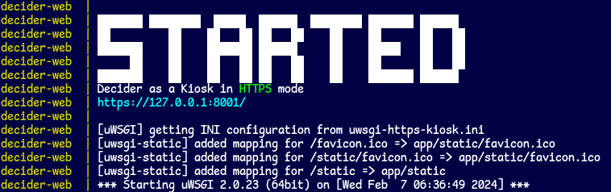

# Decider

<a rel="license" href="http://creativecommons.org/licenses/by/4.0/"></a><br />This work is licensed under a <a rel="license" href="http://creativecommons.org/licenses/by/4.0/">Creative Commons Attribution 4.0 International License</a>.  
This project makes use of MITRE ATT&amp;CK&reg; - [ATT&amp;CK Terms of Use](https://attack.mitre.org/resources/terms-of-use/).

## :newspaper: 3.0.0 - Kiosk is Here

- Decider is now login-less and responsive.
- Content updates have been simplified to copying files and restarting Docker.
- The Docker setup has changed enough that there isn't exactly a 2 &rarr; 3 update process, just a fresh install of 3.
- The database structure is the same though - so Decider 2.x.y can be leveraged for editing content.

***This is Firefox - but it works on mobile too!***  


## :thinking: What is it?

### :fast_forward: In-Short

A web application that assists network defenders, analysts, and researchers in the process of mapping adversary behaviors to the MITRE ATT&CK® Framework.

### :closed_book: In-Depth

Decider is a tool to help analysts map adversary behavior to the MITRE ATT&CK Framework. Decider makes creating ATT&CK mappings easier to get right by walking users through the mapping process. It does so by asking a series of guided questions about adversary activity to help them arrive at the correct tactic, technique, or subtechnique. Decider has a powerful search and filter functionality that enables users to focus on the parts of ATT&CK that are relevant to their analysis. Decider also has a cart functionality that lets users export results to commonly used formats, such as tables and [ATT&amp;CK Navigator](https://mitre-attack.github.io/attack-navigator/) heatmaps.

### :book: User Guide

[Over Here](./docs/user_guide_3_0_0/user-guide-3-0-0.pdf)

### :triangular_ruler: Intended Purpose

Decider ultimately tries to make mapping to [ATT&amp;CK](https://attack.mitre.org/) easier.

It offers:
- A question tree with pagination of results (structures your progress)
- Technique search + filtering options
- Suggestions of other techniques that may have occurred

Decider does not intend to replace the ATT&amp;CK site - but rather, it acts as a complementary tool that leads you there in the end. Only information assisting mapping is included.

## :computer: In-App Screenshots

### :deciduous_tree: Question Tree

\(*you are here*\)**\[Matrix > Tactic\]** > Technique > SubTechnique


### :mag: Full Technique Search

Boolean expressions, prefix-matching, and stemming included.


## Installation

### :whale: Docker

**Best option for 99% of people**

```bash
git clone https://github.com/cisagov/decider.git
cd decider
cp .env.docker .env
cp -r default_config/. config/
sudo docker compose up
```

Then visit http://localhost:8001/

It is ready when **Starting uWSGI** appears


#### Config Made Easy

Changing `config/`? Just:

```bash
sudo docker compose stop
sudo docker compose start
```

However, changing variables in .env requires

```bash
sudo docker compose up
```

which will recreate containers with modified environments

#### HTTPS / URL

##### Endpoint Determination (.env vars):

- `WEB_HTTPS_ON=''` -> http://`WEB_IP`:`WEB_PORT`/
- `WEB_HTTPS_ON='anything'` -> https://`WEB_IP`:`WEB_PORT`/

##### HTTPS Cert Location

- Write these 2 files to set SSL up:
  - config/certs/decider.key
  - config/certs/decider.crt
- If either file is missing, a self-signed cert is generated and used instead

### :technologist: Manual Install

#### Ubuntu 22.04

[Ubuntu Install Guide](docs/install/Ubuntu_22.04.2.md)

#### CentOS 7

[CentOS Install Guide](docs/install/CentOS_7.md)

#### Pip Requirements Note

##### For Everyone
```bash
pip install -r requirements-pre.txt
pip install -r requirements.txt
```

##### For Developers
```bash
pip install -r requirements-dev.txt
pre-commit install
```

#### Other OSes

Read the Ubuntu &amp; CentOS guides and recreate actions according to your platform.

##### Windows

`open()` in Python uses the system's default text encoding
- This is `utf-8` on macOS and Linux
- This is `windows-1252` on Windows
  - This causes issues in reading the jsons for the database build process
  - Adding `encoding='utf-8'` as an arg in each `open()` ***may*** allow Windows deployment

##### macOS

(M1 users at least) Make sure to (1) install Postgres before (2, 3) installing the pip requirements
1. `brew install postgresql`
2. `pip install -r requirements-pre.txt`
3. `pip install -r requirements.txt`

## :gear: Requirements

*as of April 24th, 2023*

### Software

#### Docker

Exact required version(s) unspecified.
- An up-to-date version of Docker and Docker Compose should be used.
- `docker compose` should work, whereas `docker-compose` is outdated.

#### Manual

- Operating System
  - CentOS 7+
  - Ubuntu 22.04.2+
  - Fedora 37+ works fine *\(earlier versions should work too\)*
- Python 3.8.16
- PostgreSQL 12+

### Hardware

#### Suggested Specs

- 1-2 Cores
- 1-2 GB Memory
- 20 GB Disk Space

Decider has not yet been tested against many concurrent users (this is soon to change).  
But it is extremely lightweight - it sits at roughly 250MB of RAM total for both containers (`docker stats`).  
It does peak during the build process where sources are loaded into RAM, hitting 375MB or so.

## :judge: ATT&amp;CK&reg; Data Disclaimer

JSONs under default_config/build_sources/enterprise-attack are pulled from https://github.com/mitre-attack/attack-stix-data/tree/master/enterprise-attack

## Appendix A: Updating ATT&amp;CK Content on Decider 1/2

### :whale: Docker Update Instructions

```bash
# (in repo root)

# pull v13 content
git pull

# remove containers (DB data is safe)
sudo docker compose down

# rebuild images (v13 files copy-over)
sudo docker compose up --build

# add version
sudo docker exec decider-web python -m app.utils.db.actions.add_version --config DefaultConfig --version v13.0
```

### :technologist: Manual Update Instructions

```bash
# (install root, same as repo root, contains app/ folder)
cd /opt/decider/1.0.0

# use decider app-user, with app venv, for add_version script
sudo -u decider -g decider /opt/decider/python3.8.10/bin/python3.8 -m app.utils.db.actions.add_version --config DefaultConfig --version v13.0
```
