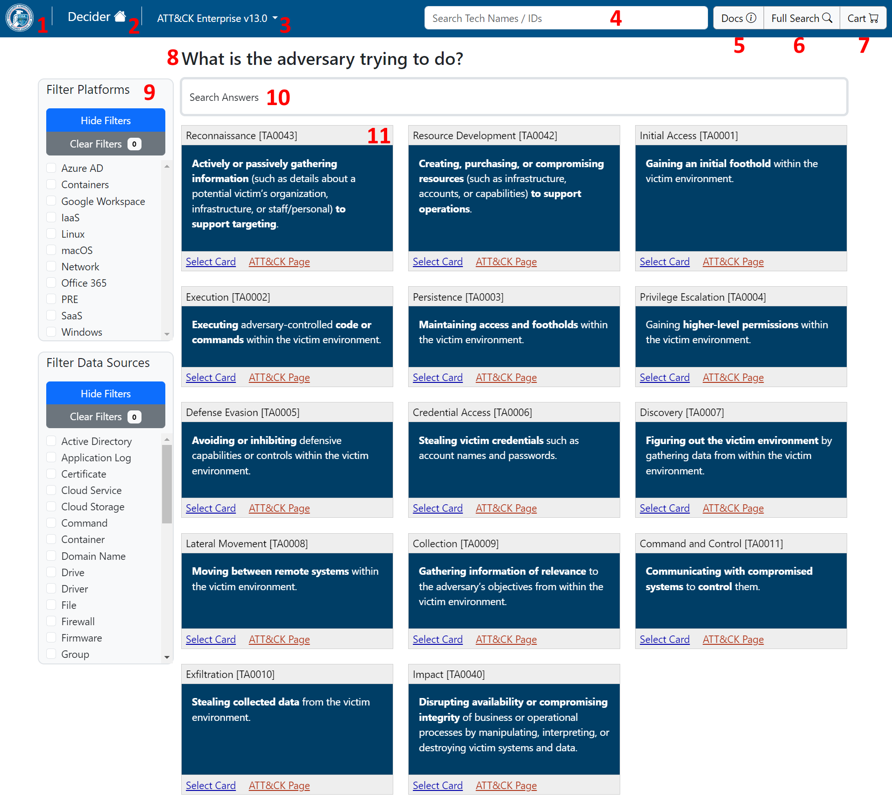
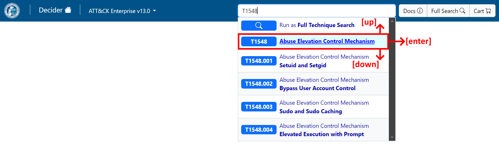
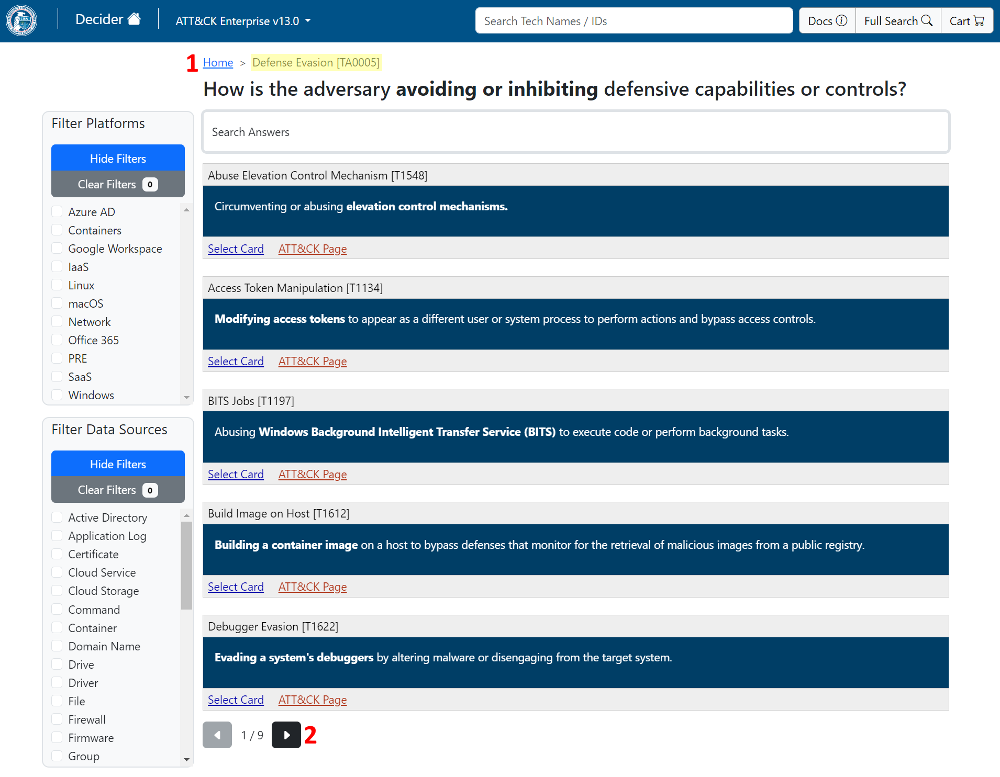
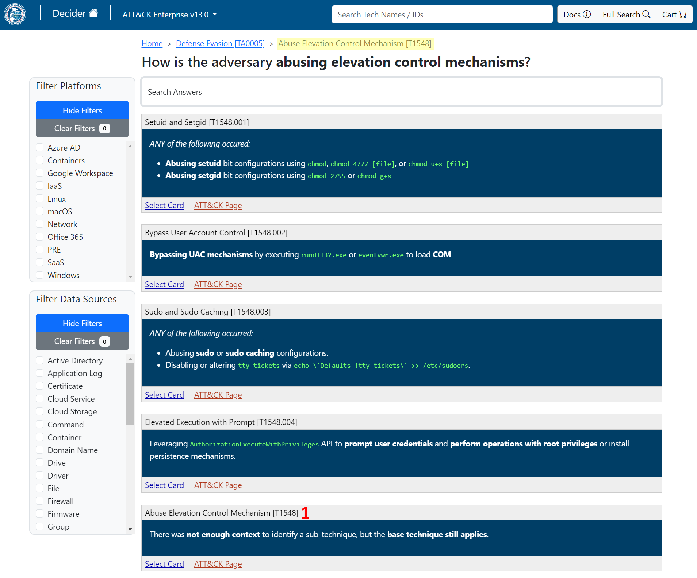
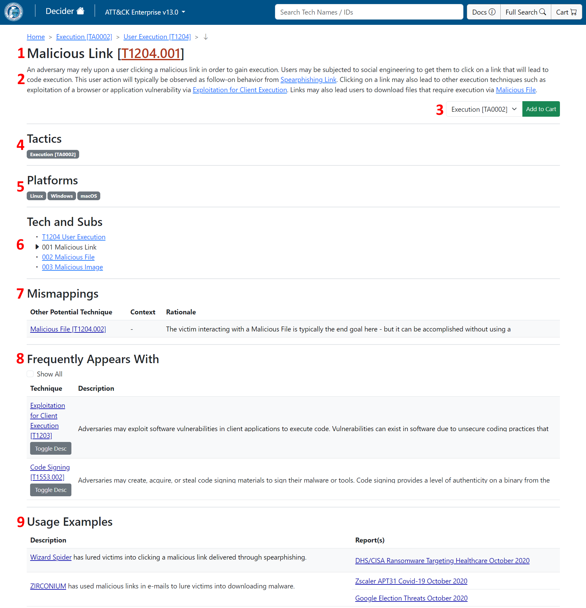
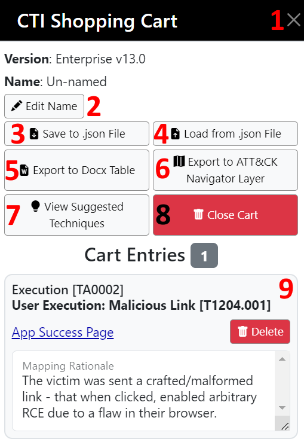
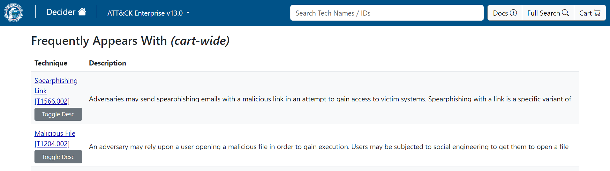
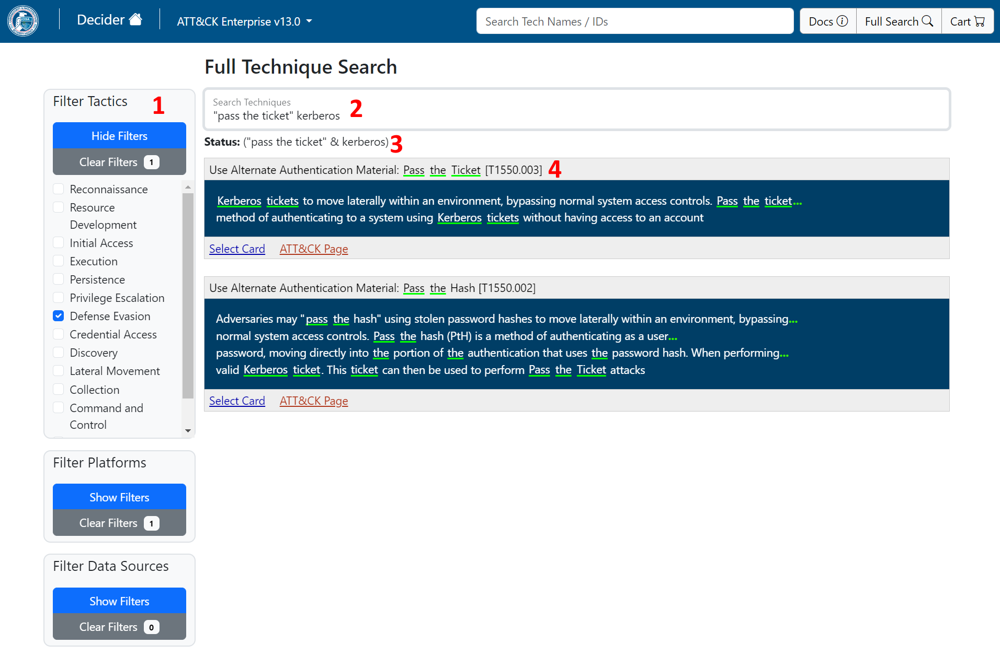

<!--
Pandoc Manual
https://pandoc.org/MANUAL.html

Render to HTML
pandoc --from markdown+link_attributes+implicit_figures --strip-comments --section-divs --embed-resources --standalone --toc --toc-depth=6 --to html -o ../../app/static/user-guide.html user-guide.md
-->

---
lang: en-US

colorlinks: true
linkcolor: blue
urlcolor: blue
toccolor: black

title: Decider User Guide

subtitle: |
    Version 3.0.0 - Loginless 'Kiosk'  
    _(use version 2.x.y for content authoring)_
---

## Introduction

### About

Decider is a web application that assists network defenders, analysts, and researchers in the process of mapping adversary behaviors to the MITRE ATT&amp;CK&reg; framework. 

**Produced For**  
Department of Homeland Security  
{width=280}\

**Produced By**  
Homeland Security Systems Engineering and Development Institute (HSSEDI&trade;)  
{width=300}\

**Code:** [Decider's GitHub Repo](https://github.com/cisagov/decider)

**Notice:** This project makes use of MITRE ATT&amp;CK&reg; - [ATT&amp;CK Terms of Use](https://attack.mitre.org/resources/legal-and-branding/terms-of-use/)

#### What is the 'Kiosk'?

Decider Kiosk is a loginless version of Decider meant to be hosted as a publicly-accessible website.  
User accounts, database-saved carts, and content authoring have all been removed from the application.  
The frontend was also cleaned up - to improve accessibility and responsiveness.  
The UI works on phones without issue.

#### Key Features

Decider has 3 key features:

- Question Tree
- Full Technique Search
- Shopping Cart

##### Question Tree Summary
_(structured progression through ATT&amp;CK)_

Decider's homepage is the root of a question tree _(matrix level)_.  
The answer cards on this page are Tactics _(adversary goals)_.  
Clicking one progresses you along.

You descend down the hierarchy as such:  
Matrix **\>** Tactic **\>** Technique **\>** SubTechnique

Once you reach a (Sub)Technique, you can view a detailed page about it.  
Should the description align with the adversary behavior you observed - you can add the Technique to your shopping cart.

Answer cards can be:

- filtered by relevant Platforms / Data Sources
    - knowing what systems a behavior occurred against / what data sources the behavior can be detected from reduces the amount of options to deal with
- re-ordered by a keyword search
    - providing key terms allows progressing through cards in a more optimal order

##### Full Technique Search Summary
_(ability to search and filter all Techniques at once)_

Search Technique IDs / names / descriptions using:

- prefix matching
- boolean expressions
- phrase matching

Filter Techniques by relevant:

- Tactics
- Platforms
- Data Sources

##### Shopping Cart Summary
_(a place to store your mappings, add context, and export to files)_

The 'CTI Shopping Cart' is a place where your mappings are stored.

- Cart entries have a text box where you can place mapping content / rationale / evidence
- Carts can be saved-to and loaded-from JSON files
- Carts can be exported to a(n)
    - [ATT&CK Navigator](https://mitre-attack.github.io/attack-navigator/) layer
        - _(to visualize the attack heatmap in relation to defenses / existing adversary heatmaps)_
    - Microsoft Word Doc
        - _(creates a table of mapped Techniques + mapping context that can be embedded in a report)_

#### Support / Troubleshooting

Please create an issue / discussion on [Decider's GitHub](https://github.com/cisagov/decider).

#### Does Decider Compete with the ATT&amp;CK Website?

**No**, Decider complements the ATT&amp;CK website.

Decider does not contain all of the information that is available on the ATT&amp;CK website.  
It primarily contains information on Tactics, Techniques, and the Platforms / Data Sources related to Techniques.

The goal of Decider is to aid in mapping threat reporting / adversary behaviors.  
Once one has mappings - they can leverage the ATT&amp;CK website for further insights / next steps (i.e. detections, mitigations).

### Proposed Workflow

1. Go to the question tree homepage _(click **Decider (Tree Home)** in the top left)_
2. Identify the goal of the adversary's actions _(Tactic)_ - click this card
3. Identify what Platform(s) the adversary's actions occurred on/against and set these filters
    - _(optionally set Data Sources their behavior could be detected by)_
4. Follow the remaining prompts to end up on a (Sub)Technique Success Page
5. Read the Technique's description
    - A. if it matches the observed behavior, then add it to your cart
        - Before adding to your cart
            - If the **Mismappings** section is present
                - double check that the **Other Potential Technique(s)** do not apply instead
        - After adding to your cart
            - If the **Frequently Appears With** section is present
                - skim the suggested Techniques, as the adversary _may_ have leveraged them too
    - B. if it does not match the observed behavior, backtrack
        - a different SubTechnique may apply
        - **(or)** the 'Base' Technique may apply instead of one of its SubTechniques
        - **(or)** a different Technique may apply
        - **(or)** a different Tactic may apply even

### CISA Best Practices for MITRE ATT&CK Mapping

The mapping steps below follow those identified in [CISA's ATT&CK Mapping Guide](https://us-cert.cisa.gov/sites/default/files/publications/Best%20Practices%20for%20MITRE%20ATTCK%20Mapping.pdf). Analysts may choose their own starting point based on their familiarity with ATT&CK and the technical details / context available in the report.

1. **Identify Tactics** – Comb through the report to identify the adversary’s tactics and the flow of the attack. To identify the tactics (the adversary’s goals), focus on what the adversary was trying to accomplish and why. Review the tactic definitions to determine how the identified behaviors might translate into a specific tactic. Each tactic includes a finite number of actions an adversary can take to implement their goal. Understanding the flow of the attack can help identify the techniques or sub-techniques that an adversary may have employed.

2. **Identify Techniques** – After identifying the tactics, review the technical details associated with how the adversary tried to achieve their goals. Note: if you have insufficient detail to identify an applicable technique, you will be limited to mapping to the tactic level, which alone is not actionable information for detection purposes. Compare the behavior in the report with the description of the ATT&CK techniques listed under the identified tactic. If one of them matches, then it may be an appropriate technique. Be aware that multiple techniques may apply concurrently to the same behavior.

3. **Identify Sub-Techniques** – Review sub-technique descriptions to see if they match the information in the report. A match here may be an appropriate sub-technique. Read sub-technique descriptions carefully to understand the differences between them. In cases where the parent of a sub-technique aligns to multiple tactics, make sure to choose the appropriate tactic. Note: map solely to the parent technique only if there is not enough context to identify a sub-technique.

Consider techniques and sub-techniques as elements of an adversary’s playbook, rather than as isolated activities. Adversaries often use information they obtain from each activity in an operation to determine what additional techniques they will use next in the attack cycle. Because of this, techniques and sub-techniques are often linked in the attack chain.

## Navigating Decider

### Question Tree (Home) + Navbar

The **Question Tree** allows you to locate which Technique occurred by answering questions that narrow from Tactic to Technique, and optionally, SubTechnique.  
The **Navbar** allows you to quickly access key parts of the app: the start of the question tree, the full search page, the CTI shopping cart, and app documentation.

\

#### Usage {.unlisted}

Answer the _Question_ (8) by clicking one of the _Answer Cards_ (11).  
Optionally reduce the amount of cards to sift through by settings _Filters_ (9).  
Optionally order the answer cards by keyword relevance using _Search Answers_ (10).

1. **CISA Logo** - Links to [CISA.gov](https://www.cisa.gov/)
2. **Decider Tree Home** - Takes you to this page _(the question tree home)_
3. **Version Picker** - Lets you to change what version of ATT&amp;CK data you're viewing
4. **Mini Technique Search** - Lets you quickly jump to a Technique's page by its name or ID
5. **Docs** - Opens this user guide
6. **Full Technique Search** - Opens the Full Technique Search page, which supports searching/filtering all Techniques at once
7. **CTI Shopping Cart** - Opens the CTI Shopping Cart, where your mappings can be viewed, edited, saved, or exported
8. **Question** - You select the _Answer Card_ (11) that best answers this prompt
9. **Filters** - These allows hiding _Answer Cards_ (11) that do not match the specified criteria
    - Filter Types
        - **Platforms** are the system types that the behavior occurred on/against
        - **Data Sources** are means by which behavior could have been detected
    - Filtering Advice
        - **Ignore on the homepage,** there are only 14 Tactics to pick from, no need to filter here
            - Also, Tactics have all Platforms / Data Sources of the Techniques under them. Setting a Platform filter + a Data Source filter may show a Tactic that has no Techniques under it fulfilling that filter combo
        - **Be generous,** an answer card is shown if it matches any of the filters _(of a given type)_
            - Accidentally hiding the correct answer card by mis-selecting would be detrimental
            - The goal of filters is to generally narrow how many answer card you need to look at _(Defense Evasion has 42 'Base' Techniques as of v13)_
10. **Search Answers** - This re-orders the _Answer Cards_ (11) by relevance to the keywords you've entered
    - Search Functionality
        - **On Matrix &rarr; Tactics Homepage**
            - There are only 14 Tactics, this is a basic keyword search
        - **On Deeper Pages**
            - Advanced search functionality is supported here
            - Typed words are OR'd together by default
            - **&amp;** _(ampersand)_ requires both terms to be present
            - **|** _(pipe)_ requires either term to be present
            - **~** _(tilde)_ requires a term to be absent
            - **\(\)** _(parentheses)_ can be used to order AND/OR/NOT operators
            - **\*** _(asterisk)_ is used for prefix matching _(proc\* &rarr; proc, process, procedure)_
            - **&quot;&quot;** _(double quotes)_ specify that each word in a phrase must be present _(non a-z0-9 characters are stripped)_
11. **Answer Cards** - You pick the answer that best answers the _Question_ (8).  
    - These represent Tactics, the Techniques, and finally SubTechniques as you progress through the ATT&amp;CK hierarchy structure.
    - Clicking the card progresses you through the tree (same as clicking 'Select Card').
    - Clicking 'ATT&amp;CK Page' opens the ATT&amp;CK page for the given Tactic/Technique

#### Navbar > Version Picker

The version picker allows you to change what ATT&amp;CK version the app is showing content for. Currently, only the Enterprise domain is supported.

\

##### Usage {.unlisted}

1. **Current Version** - This shows the current ATT&amp;CK version the app is showing content for. Clicking this reveals _Other Versions_ (2)
2. **Other Versions** - This shows as a dropdown of available versions, each prefaced with '(change to)'

#### Navbar > Mini Technique Search

The mini search allows you to quickly reach a Technique's Success Page by its name or ID.

\

##### Usage {.unlisted}

Use to quickly jump to a Technique's Success Page.  
Or to start a Full Technique Search.

- **Searching** - Techniques can be searched by Name or ID here
- **Keyboard Navigation** is supported as well _(in addition to mouse, touchscreen, etc)_
    - **\[up\]** and **\[down\]** to select options
    - **\[enter\]** to open the selected entry
        - If a selection has not yet been made, a Full Technique Search is performed by default

#### Question Tree > Tactic

A Tactic card was clicked to reach this page. This page allows picking which Technique under the current Tactic applies.

\

##### Usage {.unlisted}

1. **Breadcrumb Bar** - This shows your progress through the question tree
    - You can click crumbs to navigate back up the tree
2. **Page Select** - These buttons allow you to flip through the available answer card pages
    - 5 answer cards are shows per page

#### Question Tree > Technique

A Tactic card and then a Technique card were clicked to reach this page. This page allows picking which SubTechnique under the current Technique applies (to view its Success Page). Or, if no SubTechnique applies, allows picking the base Technique to view its Success Page.

\

##### Usage {.unlisted}

1. **Base Technique Card** - Notice that this answer card has the same ID as the question page we're on. This is because the 'Base' Technique still applies even if we did not find behavior specific to any of the SubTechniques. (This card's heading matches the current page breadcrumb that is above the question).

#### Question Tree > Technique Success Page

This Technique page is reachable through either the Question Tree, Full Search, Mini Search, or CTI Shopping Cart. It provides information about the Technique.

\

##### Usage {.unlisted}

1. **Technique Name / ID** - The ID is also a link to the Technique's ATT&amp;CK page
2. **Technique Description** - This is the same description as on the Technique's ATT&amp;CK page
3. **Map Technique Under Tactic + Add to Cart**
    - 'Technique Success Pages' can be reached through the Question Tree or through the Full Technique Search
        - The Question Tree already gives you the Tactic context you're working with (dropdown is pre-selected)
        - Whereas getting to a Success Page via Search will require you to select a Tactic before the Add-to-Cart button works
    - Clicking Add-to-Cart places an entry for the selected Technique+Tactic combo in your mapping cart
4. **Tactics** - Goals this behavior can achieve
5. **Platforms** - Systems this Technique can be leveraged against/on
6. **Tech and Subs** - Success Page links for the Base Technique and its Sub Techniques
7. **Mismappings** - Techniques listed here may have occurred instead of the Technique on this page
    - That is, this table records knowledge of previously incorrectly mapped Techniques _(user editable)_
    - Decider does not provide any mismappings out of the box
    - Mismappings can be added via JSON during the build process
        - **(or)** a Decider 2.x.y instance can be pointed at the same database used by Kiosk (Decider 3.x.y) in order to edit these
    - _(This section is hidden if the Technique has no mismappings)_
8. **Frequently Appears With** - Techniques here are likely to have occurred with the current Technique being viewed
    - Skim the Technique descriptions to see if any match the observed adversary behaviors
    - The table shows a slightly randomized subset of suggested Techniques - this is to help prevent availability bias in mapping
        - Checking **Show All** will list all suggestions
    - This dataset comes from Andy Applebaum's work - [Medium Article](https://medium.com/mitre-attack/finding-related-att-ck-techniques-f1a4e8dfe2b6)
        - In short: Techniques that frequently appear together in CTI reports, _may_ appear together in future adversary behavior too
    - _(This section is hidden if the Technique has no cooccurrences)_
9. **Usage Examples** - These are examples of the Technique being used by Campaigns, Groups, Software, and Tools.
    - Reports covering / mapping the observation are linked too
    - _(This section is hidden if the Technique has no usage examples)_

### CTI Shopping Cart

The cart allows you to record Techniques for observed behaviors, along with rationales for mapping them. Carts can be saved, loaded, and exported to Word Docs or ATT&amp;CK Navigator sheets.

\

#### Usage {.unlisted}

1. **Close Cart Panel** - Closes the cart panel
2. **Edit Name** - Allows naming the cart _(changes name of exported files + saved / loaded cart)_
3. **Save to .json File** - Saves the contents of the cart as a JSON file
4. **Load from .json File** - Loads a prior-saved JSON cart file
5. **Export to Docx Table** - Creates a Microsoft Word DOCX file containing a table of the Tactics / Techniques mapped and their mapping rationales
6. **Export to ATT&amp;CK Navigator Layer** - Creates a [MITRE ATT&amp;CK&reg; Navigator](https://mitre-attack.github.io/attack-navigator/) layer with cart entries highlighted. The mapping rationales are also added to the Navigator layer in the form of comments
7. **View Suggested Techniques** - A cart-wide variant of the Technique Success Page > _Frequently Appears With_ listing
8. **Empty Cart** _(has confirmation screen)_ - Deletes the cart. Make sure you saved to a JSON before clicking this - otherwise the cart is irrecoverable
9. **Cart Entry** - A mapped Technique + Tactic combo
    - **App Success Page** - Takes you to the Technique Success Page for this entry
    - **Delete** - Removes this entry from your cart
    - **Mapping Rationale** - An area for you to record context / rationale / evidence as to why this entry was mapped. A good place for notes too

#### Cart-Wide Frequently Appears With

This page suggests other Techniques that _may_ have occurred, based upon the contents of your cart.

\

##### Usage {.unlisted}

- A cart-wide variant of Technique Success Page > _Frequently Appears With_
- Suggests Techniques that _may_ have occurred based upon the contents of your cart

Skim the Technique descriptions to see if any match the observed adversary behaviors.  
Read the full description to confirm a mapping before adding it to your cart.

### Full Technique Search

The full search page allows you to locate Techniques by searching their names, IDs, and descriptions and by filtering on the Tactics, Platforms, and Data Sources that apply to them.

\

#### Usage {.unlisted}

1. **Filters** - Only Techniques that match at least 1 filter _(per each type)_ are shown. _(a filter is ignored if 0 are set)_
    - Filter Types
        - **Tactics:** goals of the adversary's behaviors
        - **Platforms:** systems that the Technique was performed on/against
        - **Data Sources:** sources that can be used to detect the behavior
    - Filtering Advice
        - **Be generous,** it's better to accidentally include slightly more results than to miss the correct Technique by over-constraining
2. **Search Techniques** - Your search goes here
    - Searched Fields
        - IDs
        - Names
        - Descriptions
    - Usage
        - **Basic Search**
            - By default, terms are AND'd together here
            - So, typing more terms will constrain further
            - You can use **|** _(pipe)_ between terms to OR them together for a simple keyword search
        - **Advanced Search**
            - Advanced search functionality is supported here
            - Typed words are AND'd together by default
            - **&amp;** _(ampersand)_ requires both terms to be present
            - **|** _(pipe)_ requires either term to be present
            - **~** _(tilde)_ requires a term to be absent
            - **\(\)** _(parentheses)_ can be used to order AND/OR/NOT operators
            - **\*** _(asterisk)_ is used for prefix matching _(proc\* &rarr; proc, process, procedure)_
            - **&quot;&quot;** _(double quotes)_ specify that each word in a phrase must be present _(non a-z0-9 characters are stripped)_
3. **Search Status** - Provides feedback on your search
    - Warns if the search query is malformed / invalid
    - **(otherwise)** Indicates how the search query was interpreted
4. **Technique Cards** - The Technique results from your search
    - Clicking a card opens its Technique Success Page _(same as clicking 'Select Card')_
    - Clicking 'ATT&amp;CK Page' opens the Technique's ATT&amp;CK Page
